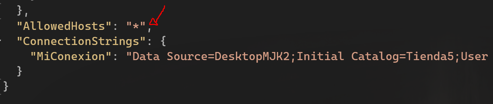
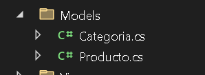
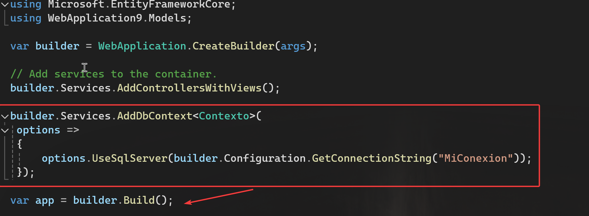
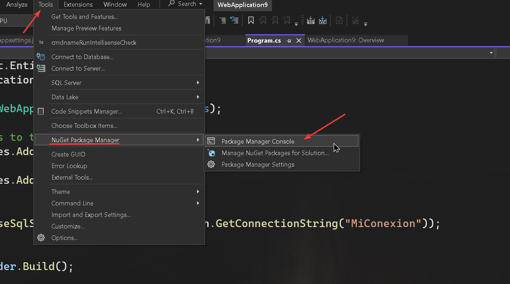
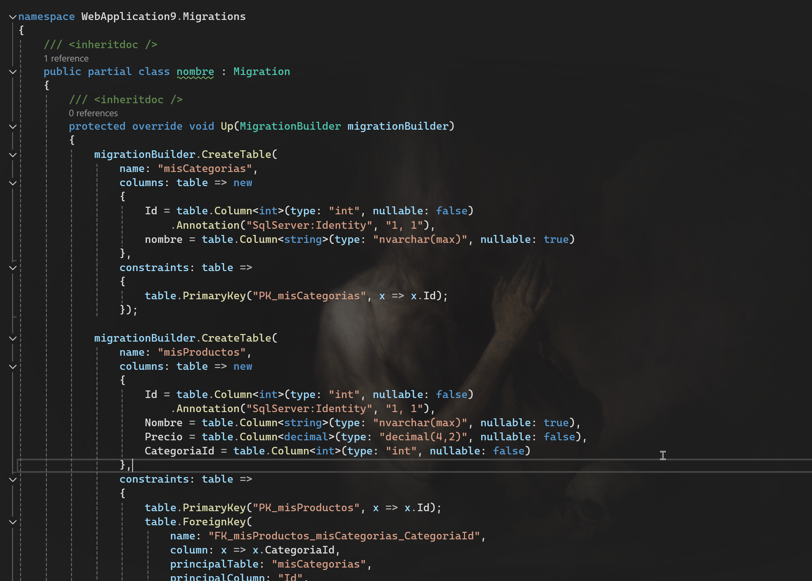
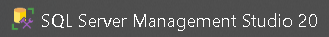
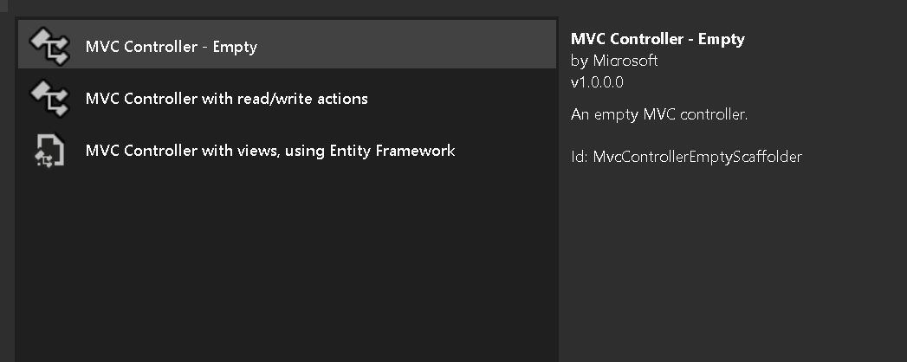
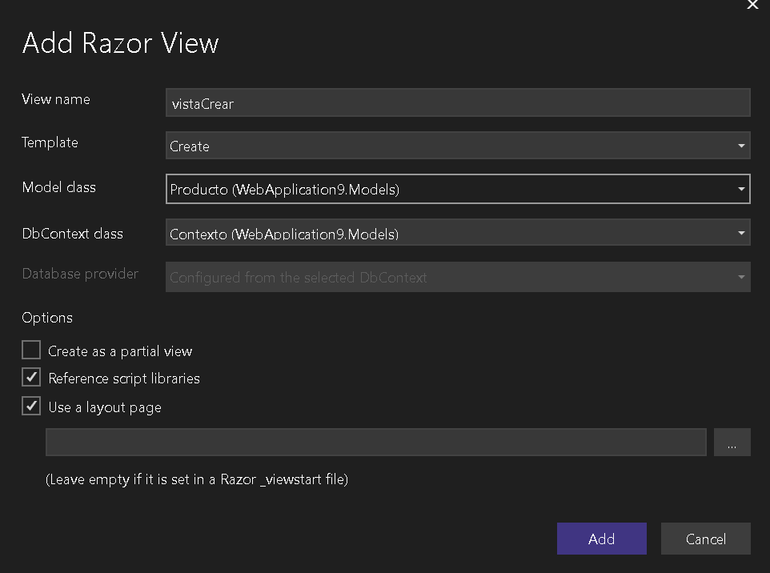
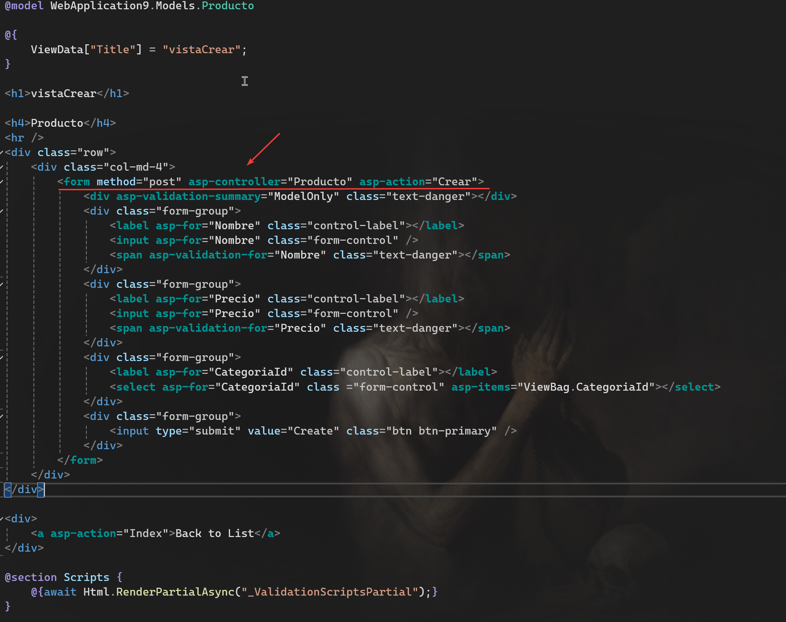

 
 
 
## Instalar paquetes Nugget
 

 Primero de todo antes de comenzar, instalamos los siguientes [paquetes Nugget](../Recordatorios.md):

- Microsoft.EntityFrameworkCore 
- Microsoft.EntityFrameworkCore.Design
- Microsoft.EntityFrameworkCore.SqlServer
- Microsoft.EntityFrameworkCore.Tools
----- 

## Cadena de conexión

<div> A continuación, tenemos que declarar la cadena de conexión de nuestra base de datos. </div>
Nos dirigimos al archivo  `App.Settings` en la raiz de nuestro proyecto.
 
 > Agregamos la siguiente cadena:
```json
"ConnectionStrings": {
  "MiConexion": "Data Source=DesktopMJK2;Initial Catalog=Tienda5;User ID=sa;Password=1234;TrustServerCertificate=True;Encrypt=True;Trusted_Connection=True;MultipleActiveResultSets=true"
}
```

<br>
Ten cuidado al copiar la cadena, no te olvides de la coma después del AllowedHost
!!! warning
    
    

### Explicación cadena de conexión

!!! info
    Esta cadena es para SQL server, si pide MySql es diferente, pulsa aquí

- Data Source -> Nombre de nuestra instancia del servidor de base de datos
- Initial Catalog -> El nombre de la base de datos que queramos gestionar
- User -> Tu usuario, si lo tienes por defecto es `sa`
- Password -> La contraseña del usuario, si lo tienes por defecto es `sa` (Si no funciona prueba con 1234)

------

## Crear modelo de datos

El siguiente paso es crear los modelos, recordamos que un modelo es una representación de una tabla.
<br>

  

Creamos una clase por tabla en la carpeta Models

###  Ejemplo modelo

```csharp
 public class Producto
 {
     public int Id { get; set; }
     public string? Nombre { get; set; }

     [Column(TypeName = "decimal(4, 2)")]
     public decimal Precio { get; set; }
     public int CategoriaId { get; set; }
     [ForeignKey(nameof(CategoriaId))]
     public Categoria categoria { get; set; } = null!;

 }
```
Cada propiedad con public y su respectivo tipo de dato (Recuerda: Si en la base de datos es varchar, aquí lo ponemos como string).
<br>

!!! note
    Las primary key se identifica con: `Id`, `NombreId` o especificando `[key]` arriba en el caso de que tengamos un nombre diferente.
    <br>

- `[Column(TypeName = "decimal(4, 2)")]` Es para especificar de cuantas cifras es el numero (4) y cuantos números después de la coma tiene: 1000,45 sería un ejemplo con esta configuración.

- `[ForeignKey(nameof(CategoriaId))]` Identifica a una foreign key, primero creamos un campo, en este caso de tipo int, después, creamos un objeto del modelo que estamos haciendo referencia.

```csharp
// Primero la propiedad para almacenar la foreign key
 public int CategoriaId { get; set; }
 // Aquí especificamos que es una foreign key y dentro del parentesis le pasamos la propiedad de arriba
 [ForeignKey(nameof(CategoriaId))]
 // La siguiente propiedad es un objeto del modelo (la otra tabla)
 public Categoria categoria { get; set; } = null!;
```
<br>

Si no tenemos la base de datos creada y tenemos que crearla mediante una migración, (más adelante), podemos agregarle al Id un auto_increment, que sería agregarle encima lo siguiente:


```csharp
[Key]
[DatabaseGenerated(DatabaseGeneratedOption.Identity)]  // Auto increment
public int Id { get; set; }
```

De esta manera crearíamos todos los modelos, cambiando tipos de datos y nombres, (No todos los modelos tienen foreign keys).

------

## Crear clase DbContext

Ahora nos toca crear una clase DbContext que va a actuar como puente entre la base de datos y nuestra aplicación.
Para ello, en la carpeta `Models` creamos una nueva clase, en este caso la voy a llamar `Contexto`, pero puede tener otro nombre.
Mi recomendación es que no lo cambies, para que no haya luego lios con nombres.

```csharp
public class Contexto : DbContext
{
    public Contexto(DbContextOptions<Contexto> options) : base(options)
    {
    }
   
    public DbSet<Producto> misProductos { get; set; }
    public DbSet<Categoria> misCategorias { get; set; }
}
```

<div> Si le has llamado de otra forma a la clase, reemplaza Contexto por el nombre que le hayas asignado. </div>
No te olvides de agregar `: Dbconext` después del nombre de la clase.

Los `DbSet<>` nos van a servir para mapear las tablas de la base de datos, por cada modelo que crees, tienes que agregar un `DbSet`, en este ejemplo tenemos solo dos, producto y catergoría, puedes fijarte [aquí](/Examen/2024/06/23/entity-framework/#crear-modelo-de-datos) 

!!! note
    En el caso de no tener las tablas ya creadas en la base de datos, haremos una `migración` más adelante, esta, nos va a crear las tablas con el nombre que le asignemos aquí al DbSet, en este caso, nos crearía dos tablas: `misProductos` y `misCategorias`

----

Una vez tenemos la clase `Contexto` configurada, tenemos que editar el fichero `program.cs`

```c#
builder.Services.AddDbContext<Contexto>(
 options =>
 {
     options.UseSqlServer(builder.Configuration.GetConnectionString("MiConexion"));
 });
```
CUIDADO DONDE SITUAMOS EL CÓDIGO DE ARRIBA

!!! warning
    
    
Tenemos que asegurarnos de que está por encima del `builder.Build`


Teniendo los modelos, la clase contexto y la cadena de conexión tenemos dos opciones: 

- No tenemos la base de datos creada, (Nos piden que lo hagamos mediante migraciones).
- Ya tenemos la base de datos creada, (Hemos hecho el script manual). -> Saltar directamente [aquí](/Examen/2024/06/23/entity-framework/#crud-con-entity-framework)

------

## Migraciones

El primer paso para hacer una migración es abrir una terminal -> Herramientas -> Nuget Manager -> Consola



Dentro de la ternminal ejecutamos el siguiente comando:

```csharp
Add-Migration "nombre"
```
Nos va a aparecer una nueva ventana con un archivo nuevo (NO BORRAMOS NADA, LO DEJAMOS TAL CUAL).



 En el caso de que nos aparezca vacio, o casi vacio:

!!! info
    En la carpeta Migraciones borramos todas las migraciones y volvemos a crear una nueva (snapshot incluida).

 El siguiente comando que vamos a ejecutar es:

 ```csharp
 Update-Database
 ```
 Este comando nos va a insertar las tablas en la base de datos que hayamos asignado en la [cadena de conexión](/Examen/2024/06/23/entity-framework/#cadena-de-conexion)

Abrimos el administrador de Sql Server, (NO ES EL XAMPP!!).



 Iniciamos sesión con las credenciales que hemos asignado en la [cadena de conexión](/Examen/2024/06/23/entity-framework/#cadena-de-conexion) y comprobamos que nos ha creado la base de datos con las tablas que van a coincidir con el nombre que le asignamos a los modelos en el [DbSet](/Examen/2024/06/23/entity-framework/#crear-clase-dbcontext).

-----

## CRUD con Entity Framework

Teniendo ya la base de datos poblada con las tablas, es hora de crear `controladores`.

Recordamos que cada controlador va a coger datos de los modelos y visualizarlo en la vista.

### Crear un controlador

Sobre la carpeta `Controllers` hacemos clic derecho -> Agregar -> Controlador



Vamos a elegir la plantilla vacia, así lo hacemos manual y usamos el teclado para que suene más.

En cuanto al nombre la convención es NombreModeloController -> ProductoController, ClienteController, _etc, etc. ;\)_


```csharp
public class ProductoController : Controller
{
    private readonly Contexto _contexto;

    public ProductoController(Contexto conexto)
    {
        _contexto = conexto;
    }
    public IActionResult Index()
    {
        return View();
    }
}
```
Acuérdate que tienes que modificar el nombre `Producto` por el modelo que estés usando.
Aquí estamos creando un constructor para que instancie el contexto que nos va a servir para hacer peticiones a la base de datos.

## Crear métodos controlador

En esta sección vamos a crear todos los métodos para hacer un CRUD (Create, Read, Update, Delete).

### Crear o Insertar

Primero de todo, creamos un método que returne una vista que va a ser un formulario donde el usuario va a rellenar los campos y en base a esos datos, vamos a hacer un insert en la base de datos.

```csharp
 public IActionResult vistaCrear()
 { 
     return View();
 }
```

Ahora hacemos clic derecho encima de `vistaCrear` y le damos a agregar vista. Cogemos la que tiene plantilla.



EL NOMBRE NO LO CAMBIAMOS, elegimos la plantilla crear, el modelo correspondiente y el DbContext.

Nos va a aparecer un formulario en HTML con todos los campos del modelo.



Lo único que tenemos que agregar / modificar es `method="post"`, `asp-controller="NombreControlador"`, `asp-action="NombreMetodo"`
El controlador es el mismo desde donde hemos hecho el clic derecho para agregar la vista, el método es el encargado de manejar los datos que el cliente va a rellenar en el formulario. Asignamos el nombre que queramos al action y volvemos al controlador donde vamos a crearlo.


```csharp

 /* public IActionResult vistaCrear()
 { 
     return View();
 }*/

[HttpPost]
public IActionResult Crear(Producto producto)
{
        _contexto.misProductos.Add(producto);
        _contexto.SaveChanges();
        return RedirectToAction(nameof(Index));
}
```
Añadimos antes del método `[HttpPost]` que es el método que usamos para enviar formularios.
Entre paréntesis va a ir el Modelo que hemos elegido antes al crear la vista del formulario.

En cuanto a `_contexto` es el nombre que le hemos asignado arriba al crear el controlador [aquí](/Examen/2024/06/23/entity-framework/#crear-un-controlador) 
`misProductos` hace referencia al DbSet que hemos creado tambíen [arriba](/Examen/2024/06/23/entity-framework/#crear-clase-dbcontext), en este caso es productos, porque estamos usando el modelo productos.


----- 


