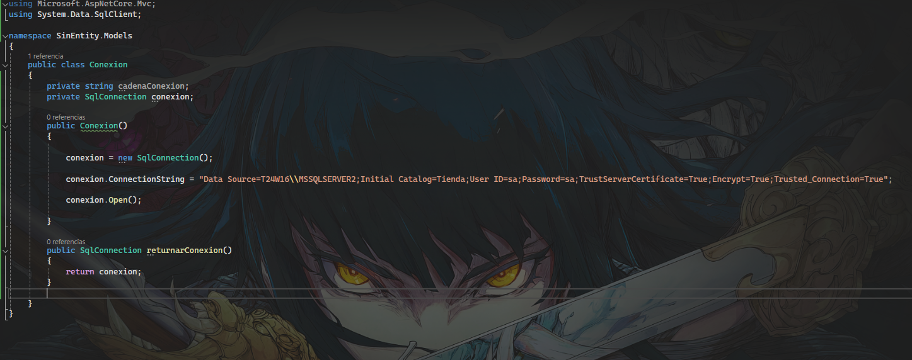
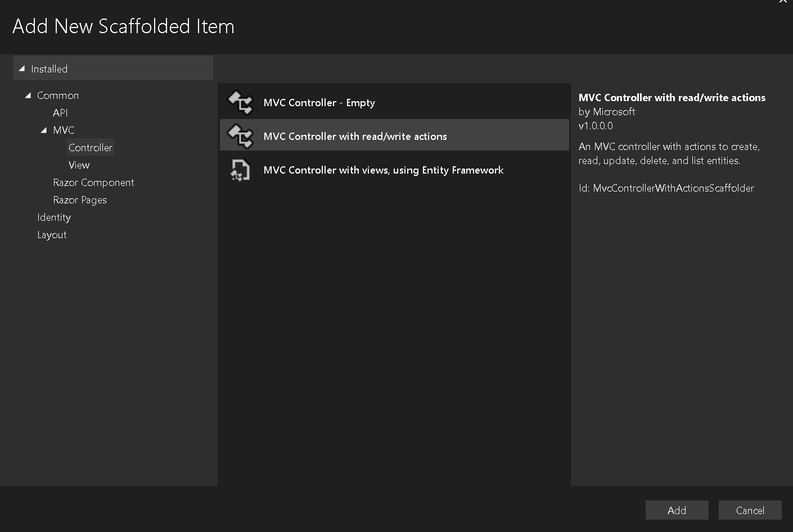
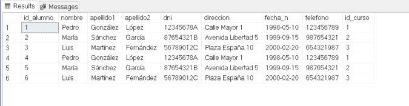
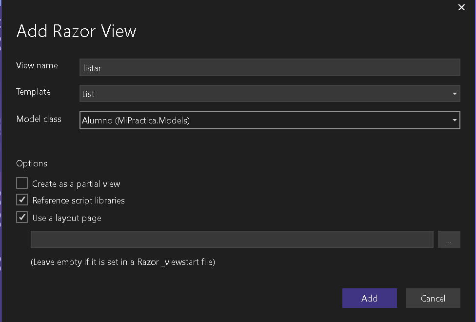
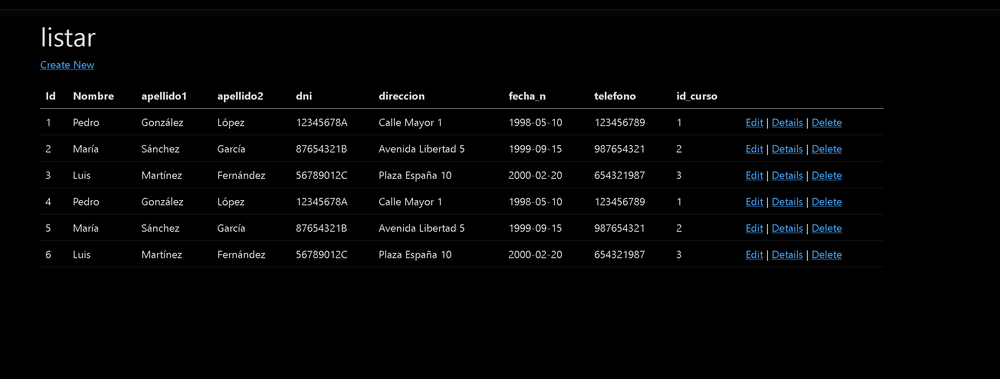
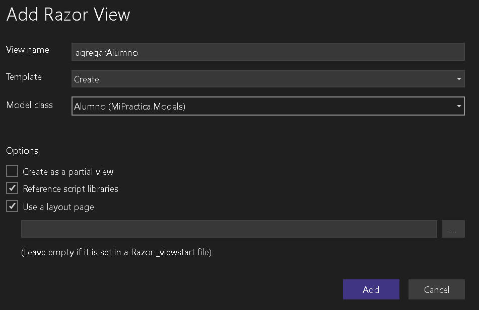
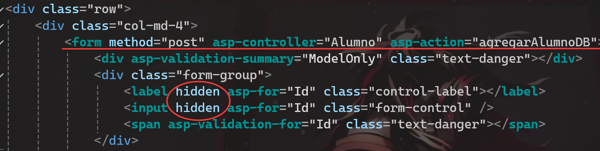
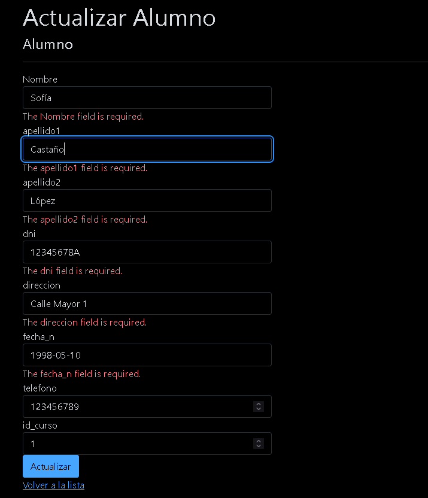

!!! note
    En este projecto vamos a usar SQL server, en el caso de que nos pidan MySql mira [aquí](/Examen/Recordatorios/#conexion-mysql)


## Instalar paquetes NuGet
Al no usar Entity Framework vamos a necesitar menos paquetes [NuGet](../Recordatorios.md)
<div> </div>
- System.Data.SqlClient

## Crear clase conexión

En la clase `Models` creamos una clase en este caso la vamos a llamar `Conexion`

```csharp
  public class Conexion
  {
      private string cadenaConexion;
      private SqlConnection conexion;
  }
```

Lo primero es asignar los atributos necesarios, una string con la cadena de conexión y un objeto `SqlConnection`


```csharp
 public Conexion()
 {

     conexion = new SqlConnection();

     conexion.ConnectionString = "Data Source=T24W16\\MSSQLSERVER2;Initial Catalog=ACADEMIA;User ID=sa;Password=sa;TrustServerCertificate=True;Encrypt=True;Trusted_Connection=True";

     conexion.Open(); 

 }
```
Ahora cremos el constructor donde instanciamos el objeto `SqlConnection`, le pasamos la conexión y abrimos la conexión para que esté activa durante todo el tiempo de vida de la aplicación.

-----

### Sintaxis cadena conexión

!!! info
    Esta cadena es para SQL server, si pide MySql es diferente, pulsa [aquí](/Examen/Recordatorios/#conexion-mysql)

- Data Source -> Nombre de nuestra instancia del servidor de base de datos
- Initial Catalog -> El nombre de la base de datos que queramos gestionar
- User -> Tu usuario, si lo tienes por defecto es `sa`
- Password -> La contraseña del usuario, si lo tienes por defecto es `sa` (Si no funciona prueba con 1234)

<div> </div>

-----

### Métodos clase conexión

Por último, agregamos un método que returne la conexión, (vamos a usarlo más adelante para hacer las peticiones).

```csharp
 public SqlConnection returnarConexion()
 {
     return conexion;
 }
```

<figure markdown="span">


 <figcaption>Un vistazo de cómo quedaría la clase conexión</figcaption>
</figure>

------

## Script SQL

He hecho algunos cambios a tu script sin quitarle tu esencia, simplemente he agregado foreign keys ya que de lo contrario, no se podrá unir tablas, visualizar datos, etc, etc, etc ;)

```sql

CREATE DATABASE ACADEMIA;
USE ACADEMIA;

CREATE TABLE PROFESOR
(
    id_profesor INT PRIMARY KEY AUTO_INCREMENT,
    nombre_p NVARCHAR(100) NOT NULL
);


CREATE TABLE CURSO
(
    id_curso INT PRIMARY KEY AUTO_INCREMENT,
    nombre NVARCHAR(100) NOT NULL,
    año_i INT,
    id_profesor INT,
    FOREIGN KEY (id_profesor) REFERENCES PROFESOR(id_profesor)
);

CREATE TABLE ALUMNO
(
    id_alumno INT PRIMARY KEY AUTO_INCREMENT,
    nombre NVARCHAR(100) NOT NULL,
    apellido1 NVARCHAR(100) NOT NULL,
    apellido2 NVARCHAR(100),
    dni NVARCHAR(100),
    direccion NVARCHAR(100),
    fecha_n NVARCHAR(100),
    telefono INT,
    id_curso INT,
    FOREIGN KEY (id_curso) REFERENCES CURSO(id_curso)
);


```
Así quedaría el nuevo script, el hecho de crear tablas tiene su orden. Tienes que crear primero las que NO tienen foreign keys, después las que tengan de foreign key la recién creada tabla y así sucesivamente.
No te preocupes, ya está ordenado. 

!!! warning
    Recuerda que si nos hace usar SQL Server este script no te va a funcionar, una versión de SQL Server de tu script sería:
    ```sql
        CREATE DATABASE ACADEMIA
          GO
      USE ACADEMIA
      GO

	    CREATE TABLE PROFESOR
      (
          id_profesor INT PRIMARY KEY IDENTITY,
          nombre_p NVARCHAR(100) NOT NULL
      )
      GO


	    CREATE TABLE CURSO
      (
          id_curso INT PRIMARY KEY IDENTITY(1,1),
          nombre NVARCHAR(100) NOT NULL,
          año_i INT,
          id_profesor INT,
          FOREIGN KEY (id_profesor) REFERENCES PROFESOR(id_profesor)
      )
      GO


      CREATE TABLE ALUMNO
      (
          id_alumno INT PRIMARY KEY IDENTITY(1,1) ,
          nombre NVARCHAR(100) NOT NULL,
          apellido1 NVARCHAR(100) NOT NULL,
          apellido2 NVARCHAR(100),
          dni NVARCHAR(100),
          direccion NVARCHAR(100),
          fecha_n NVARCHAR(100),
          telefono INT,
          id_curso INT,
          FOREIGN KEY (id_curso) REFERENCES CURSO(id_curso)
      )
      GO
    ```


## Clases Modelo

Vamos a por las clases del modelo, (son las 3 tablas que has creado en tu base de datos).

!!!note
    Siempre empezamos por las que no tienen ninguna foreign key, en este caso es `Profesor`

    ```csharp
        public class Profesor
    {
        public int Id { get; set; }
        public string Nombre { get; set; }
    }
    
    ```

A continuación, seguiremos por la que tenga la foreign key de `Profesor`, en este caso, `Curso`

```csharp
 public class Curso
 {
     public int Id { get; set; }
     public string nombre_c { get; set; }
     public int nombre_d { get; set; }
     public int id_profesor { get; set; }
     [ForeignKey(nameof(id_profesor))]
     public Profesor profesor { get; set; }

 }
```

Recordamos que los `Id` si se llaman `Id`, `NombreId` no hace falta poner `[key]` encima suya.

### Foreign keys

Para declarar una [foreign key](/Definiciones/#foreign-key) lo primero que tenemos que hacer es crear un campo que sea del tipo al que va a referenciar, en este caso es un id, por lo tanto tipo `int`.

```csharp
  public int id_profesor { get; set; }
```

Ahora tenemos que declarar un objeto del tipo de la tabla de la que queremos crear una relación.

```csharp
  public Profesor profesor { get; set; }
```

Por úiltimo, especificamos el campo de foreign key (tiene que ser encima del objeto).

```csharp
  [ForeignKey(nameof(id_profesor))]
  public Profesor profesor { get; set; }
```
Si te das cuenta al hacer el `nameof()` estamos especificando el `int` que hemos creado arriba, estamos básicamente diciendo: Quiero formar una relación con la tabla `Profesor` por eso creo un objeto, y dentro de `Profesor` quiero hacer referencia a su clave primaria (id) porque se identifica unívocamente.


<div> </div>

Por último, la clase `Alumno`

```csharp
  public class Alumno
 {
     public int Id { get; set; }
     public string Nombre { get; set; }

     public string apellido1 { get; set; }

     public string apellido2 { get; set; }

     public string dni { get; set; }

     public string direccion { get; set; }

     public string fecha_n { get; set; }

     public int telefono { get; set; }

     public int id_curso { get; set; }
     [ForeignKey(nameof(id_curso))]
     public Curso curso { get; set; }


 }

```

-----

## Dummy Inserts
Antes de empezar con los controlodares vamos a hacer unos insert para tener datos en nuestras tablas.

```sql
USE ACADEMIA;

-- Insert data into PROFESOR table
INSERT INTO PROFESOR (nombre_p) VALUES
    ('Juan Pérez'),
    ('María Rodríguez'),
    ('Carlos Gómez');

-- Insert data into CURSO table
INSERT INTO CURSO (nombre, año_i, id_profesor) VALUES
    ('Matemáticas', 2022, 1),
    ('Historia', 2023, 2),
    ('Física', 2022, 3);

-- Insert data into ALUMNO table
INSERT INTO ALUMNO (nombre, apellido1, apellido2, dni, direccion, fecha_n, telefono, id_curso) VALUES
    ('Pedro', 'González', 'López', '12345678A', 'Calle Mayor 1', '1998-05-10', 123456789, 1),
    ('María', 'Sánchez', 'García', '87654321B', 'Avenida Libertad 5', '1999-09-15', 987654321, 2),
    ('Luis', 'Martínez', 'Fernández', '56789012C', 'Plaza España 10', '2000-02-20', 654321987, 3);

```

Tienes que copiarlo desde el SQL Server Managment.


## Controladores
Vamos a por los controladores.
El plan es crear todos los controladores sin  plantilla (VACIOS), e ir modificandolos manualmente, en el caso de que te falle algo, borra todo y crea los controladores usando la segunda plantilla por defecto. Así te aseguras de que funcione.

Recordatorio: Clic derecho en la carpeta `Controllers` > Agregar > Controlador.



Elegimos la plantilla vacia, en el caso de angustia y terror, la segunda. El nombre va a ser `NombreModeloController`

### Listar

El primer paso es llamar a nuestra conexión, recordamos que para hacer `peticiones`, tu palabra favorita, necesitamos una conexión.

```sql
 public class AlumnoController : Controller
 {
     public Conexion conexion = new Conexion();   
 }
```

Una vez instanciada la conexión vamos a crear el primer método, los métodos dentro de un controlador se llaman `action`.

```csharp
 public IActionResult listar()
 {
     string peticion = "SELECT * FROM ALUMNO;";
     SqlCommand comando = new SqlCommand(peticion, conexion.returnarConexion());
     SqlDataReader reader = comando.ExecuteReader();
     List <Alumno> alumnos = new List<Alumno>();

     while (reader.Read())
     {
         Alumno alumno = new Alumno();
         alumno.Id = reader.GetInt32(0);
         alumno.Nombre = reader.GetString(1);
         alumno.apellido1 = reader.GetString(2);
         alumno.apellido2 = reader.GetString(3);
         alumno.dni = reader.GetString(4);
         alumno.direccion = reader.GetString(5);
         alumno.fecha_n = reader.GetString(6);
         alumno.telefono = reader.GetInt32(7);
         alumno.id_curso = reader.GetInt32(8);

         alumnos.Add(alumno);

     }
     return View(alumnos);
 }
```
`string peticion` Va a ser una string dónde vamos a almacenar el contenido de la petición que vamos a lanzar, basicamente la segunda parte del examen practico de ayer.

`  SqlCommand comando = new SqlCommand(peticion, conexion.returnarConexion());` SqlCommand va a ser el encargado de "escribir" la petición, basicamente junta la conexión y la petición para saber dónde y qué enviar.

` SqlDataReader reader = comando.ExecuteReader();` Necesitamos ejecutar la petición, pero a la vez, queremos leer el resultado que nos devuelve.

`  List <Alumno> alumnos = new List<Alumno>();` Creamos una lista porque el resultado de nuestra lectura nos va a devolver varios alumnos.

`while (reader.Read())` En este paso hemos ejecutado la petición y tenemos que indicarle al reader lo que queremos que lea por fila.

`Alumno alumno = new Alumno();` Creamos un alumno, ya que es un while entonces por cada fila va a crear un alumno.

```csharp

         alumno.Id = reader.GetInt32(0);
         alumno.Nombre = reader.GetString(1);
         alumno.apellido1 = reader.GetString(2);
         alumno.apellido2 = reader.GetString(3);
         alumno.dni = reader.GetString(4);
         alumno.direccion = reader.GetString(5);
         alumno.fecha_n = reader.GetString(6);
         alumno.telefono = reader.GetInt32(7);
         alumno.id_curso = reader.GetInt32(8);

         alumnos.Add(alumno);
```
Para que no haya líos, ejecuta primero la `peticion` en el SQL server y mira a ver lo que te devuelve.

<figure markdown="span">


 <figcaption>Resultado del SELECT * FROM ALUMNO</figcaption>
</figure>

Bien, entonces el primer valor que nos devuelve es el Id, entonces en el while tenemos que ir recogiendo de izquierda a derecha empezando por 0 con la siguiente sintaxis:

```csharp
alumno.Id = reader.GetInt32(0);
``` 
Cambiamos `Int32` por el tipo de dato que necesitemos.

Después de asignar todos los `reader.Get` tenemos que añadir el Alumno a la lista de alumnos.

Por ultimo returnamos la vista y como parámetro los alumnos.

#### Crear vista Listar

Toca probar si funciona. Clic derecho sobre `listar()` y le das a crear vista, esta vez con plantilla



No cambies el nombre que te conozco. 
Plantilla > Listar
Modelo de datos: Alumno, o el que corresponda.

Dentro de la vista no tocamos nada, ya estaría todo hecho gracias a nueestras configuraciones impecables.

Simplemente ejecutamos desde el botón verde oscuro de arriba.



En efecto, funciona! Para poder acceder a esta página, tienes que poner en la url
```bash
https://localhost:7021/Alumno/listar
```
De todas maneras, [aquí](/Examen/2024/06/23/entity-framework/#agregar-enlaces-al-index) te enseño a como modificar el Index con links para que no tengamos que escribir nada en la URL.

### Insertar

Vamos a por el método insertar, creamos un nuevo método en nuestro controlador. Recuerda intentar crear un controlador por cada modelo y si nos pide: listame todos los profesores pues dentro del controlador profesores, haremos los métodos reutulizando el código que te pongo aquí cambiando los atributos.

```csharp
public IActionResult agregarAlumno()
{
    return View();
}

[HttpPost]
public IActionResult agregarAlumnoDB(Alumno alumno_formulario)
{
    var nombre = alumno_formulario.Nombre;
    var apellido1 = alumno_formulario.apellido1;
    var apellido2 = alumno_formulario.apellido2;
    var telefono = alumno_formulario.telefono;
    var dni = alumno_formulario.dni;
    var direccion = alumno_formulario.direccion;
    var fecha_n = alumno_formulario.fecha_n;
    var id_curso = alumno_formulario.id_curso;


    string query = "INSERT INTO ALUMNO (nombre, apellido1, apellido2, telefono, dni, direccion, fecha_n, id_curso) VALUES (@nombre, @apellido1, @apellido2, @telefono, @dni, @direccion, @fecha_n, @id_curso)";

    SqlCommand cmd = new SqlCommand(query, conexion.returnarConexion());
    cmd.Parameters.AddWithValue("@nombre", nombre);
    cmd.Parameters.AddWithValue("@apellido1", apellido1);
    cmd.Parameters.AddWithValue("@apellido2", apellido2);
    cmd.Parameters.AddWithValue("@telefono", telefono);
    cmd.Parameters.AddWithValue("@dni", dni);
    cmd.Parameters.AddWithValue("@direccion", direccion);
    cmd.Parameters.AddWithValue("@fecha_n", fecha_n);
    cmd.Parameters.AddWithValue("@id_curso", id_curso);

    cmd.ExecuteNonQuery();

    return RedirectToRoute(new { controller = "Home", action = "Index" });
}

<div> </div>

```
Primero creamos la vista, 
lo mismo, clic derecho, agregar vista con plantilla, NO CAMBIAMOS el nombre, elegimos la plantilla crear y elegimos el modelo, si vamos a insertar alumnos, elegimos alumnos, si vamos a insertar profesores, profesores.
<div> </div>


Solo hay que agregar el método post, agrgar el controlador y el método en action (aquí ponemos el del HTTPOST).
Después los campos del ID los dejamon en `hidden`, para que no se vean. Ya que en nuestra base de datos tenemos el ID en `auto increment`
<div> </div>


En cuanto a la explicación del primer código no voy a hacer mucho hincapié, simplemente tienes que agregar los campos del modelo

```csharp
[HttpPost]
public IActionResult agregarAlumnoDB(Alumno alumno_formulario)
{
    var nombre = alumno_formulario.Nombre;
    var apellido1 = alumno_formulario.apellido1;
    var apellido2 = alumno_formulario.apellido2;
    var telefono = alumno_formulario.telefono;
    var dni = alumno_formulario.dni;
    var direccion = alumno_formulario.direccion;
    var fecha_n = alumno_formulario.fecha_n;
    var id_curso = alumno_formulario.id_curso;
}
```
Entre paréntesis ponemos el modelo que querramos insertar, en este caso alumno.
con el var asignamos el valor de cada atributo.

Esto lo hacemos para la query del INSERT, cada variable va a ir en el `VALUES` con un `@`

Por eso en el `cmd` tenemos que agregar parámetros. Hacemos esto porque no sabemos qué va a insertar el usuario, entonces tenemos que vincular los valores del formulario a una variable.

!!! note
    No te olvides de cambiar los valores no siempree va a ser en base al alumno

En cuanto al `return` déjalo como está, lo que hace es basicamente redirigirnos a la página principal cuando inserte los datos.

Ejecuta el programa y comprueba si te inserta. (No te olvides de agregar el primer método al index con un link).


### Actualizar

Vamos a actualizar, este es el código, un poco extenso.

```csharp
     public IActionResult pedirIDAlumno()
    {
        return View();
    }

    

    [HttpPost]
    public IActionResult actualizarAlumno(Alumno alumnoFormulario)
    {
        Alumno alumnoEditar = new Alumno();
        alumnoEditar.Id = alumnoFormulario.Id;

        string query = $"SELECT nombre, apellido1, apellido2, dni, direccion, fecha_n, telefono, id_curso FROM Alumno where id_alumno = @id";

        SqlCommand cmd = new SqlCommand(query, conexion.returnarConexion());
        cmd.Parameters.AddWithValue("@id", alumnoFormulario.Id);

        SqlDataReader reader = cmd.ExecuteReader();

        while (reader.Read())
        {
            alumnoEditar.Nombre = reader.GetString(0);
            alumnoEditar.apellido1 = reader.GetString(1);
            alumnoEditar.apellido2 = reader.GetString(2);
            alumnoEditar.dni = reader.GetString(3);
            alumnoEditar.direccion = reader.GetString(4);
            alumnoEditar.fecha_n = reader.GetString(5);
            alumnoEditar.telefono = reader.GetInt32(6);
            alumnoEditar.id_curso = reader.GetInt32(7);
        }

        return View(alumnoEditar);
    }

 
    [HttpPost]
    public IActionResult actualizarAlumnoDB(Alumno alumnoDB)
    {
        string query = "UPDATE Alumno SET nombre = @nombre, apellido1 = @apellido1, apellido2 = @apellido2, dni = @dni, direccion = @direccion, fecha_n = @fecha_n, telefono = @telefono, id_curso = @id_curso WHERE id_alumno = @id;";
        SqlCommand cmd = new SqlCommand(query, conexion.returnarConexion());

        cmd.Parameters.AddWithValue("@id", alumnoDB.Id);
        cmd.Parameters.AddWithValue("@nombre", alumnoDB.Nombre);
        cmd.Parameters.AddWithValue("@apellido1", alumnoDB.apellido1);
        cmd.Parameters.AddWithValue("@apellido2", alumnoDB.apellido2);
        cmd.Parameters.AddWithValue("@dni", alumnoDB.dni);
        cmd.Parameters.AddWithValue("@direccion", alumnoDB.direccion);
        cmd.Parameters.AddWithValue("@fecha_n", alumnoDB.fecha_n);
        cmd.Parameters.AddWithValue("@telefono", alumnoDB.telefono);
        cmd.Parameters.AddWithValue("@id_curso", alumnoDB.id_curso);

        cmd.ExecuteNonQuery();

        return RedirectToRoute(new { controller = "Home", action = "Index" });
    }
```


#### Primera vista
Clic derecho, agregar vista, esta vez, vacia.

```csharp
@model MiPractica.Models.Alumno


<div class="row">
    <div class="col-md-4">
        <form method="post" asp-controller="Alumno" asp-action="actualizarAlumno">
            <div asp-validation-summary="ModelOnly" class="text-danger"></div>
            <div class="form-group">
                <label asp-for="Id" class="control-label"></label>
                <input asp-for="Id" class="form-control" />
                <span asp-validation-for="Id" class="text-danger"></span>
            </div>
            <div class="form-group">
                <input type="submit" value="Create" class="btn btn-primary" />
            </div>
        </form>
    </div>
</div>

<div>
    <a asp-action="Index">Back to List</a>
</div>
```

!!! warning
    Tienes que cambiar la primera linea

      ```csharp
      @model MiPractica.Models.Alumno

      ```

Reemplazas `MiPractica` por el nombre de tu proyecto en c# y Alumno por el modelo que estés actualizando.

Segunda vista, la de `actualizarAlumno`

```csharp
@model MiPractica.Models.Alumno

@{
    ViewData["Title"] = "Actualizar Alumno";
}

<h1>Actualizar Alumno</h1>

<h4>Alumno</h4>
<hr />
<div class="row">
    <div class="col-md-4">
        <form method="post" asp-controller="Alumno" asp-action="actualizarAlumnoDB">
            <div asp-validation-summary="ModelOnly" class="text-danger"></div>
            <div class="form-group">
                <input hidden asp-for="Id" class="form-control" />
            </div>
            <div class="form-group">
                <label asp-for="Nombre" class="control-label"></label>
                <input asp-for="Nombre" class="form-control" />
                <span asp-validation-for="Nombre" class="text-danger"></span>
            </div>
            <div class="form-group">
                <label asp-for="apellido1" class="control-label"></label>
                <input asp-for="apellido1" class="form-control" />
                <span asp-validation-for="apellido1" class="text-danger"></span>
            </div>
            <div class="form-group">
                <label asp-for="apellido2" class="control-label"></label>
                <input asp-for="apellido2" class="form-control" />
                <span asp-validation-for="apellido2" class="text-danger"></span>
            </div>
            <div class="form-group">
                <label asp-for="dni" class="control-label"></label>
                <input asp-for="dni" class="form-control" />
                <span asp-validation-for="dni" class="text-danger"></span>
            </div>
            <div class="form-group">
                <label asp-for="direccion" class="control-label"></label>
                <input asp-for="direccion" class="form-control" />
                <span asp-validation-for="direccion" class="text-danger"></span>
            </div>
            <div class="form-group">
                <label asp-for="fecha_n" class="control-label"></label>
                <input asp-for="fecha_n" class="form-control" />
                <span asp-validation-for="fecha_n" class="text-danger"></span>
            </div>
            <div class="form-group">
                <label asp-for="telefono" class="control-label"></label>
                <input asp-for="telefono" class="form-control" />
                <span asp-validation-for="telefono" class="text-danger"></span>
            </div>
            <div class="form-group">
                <label asp-for="id_curso" class="control-label"></label>
                <input asp-for="id_curso" class="form-control" type="number" />
                <span asp-validation-for="id_curso" class="text-danger"></span>
            </div>
            <div class="form-group">
                <input type="submit" value="Actualizar" class="btn btn-primary" />
            </div>
        </form>
    </div>
</div>

<div>
    <a asp-action="Index">Volver a la lista</a>
</div>
```

Con esto ya nos funcionaría, ten cuidado con el `@model MiPractica.Models.Alumno`



Si te molesta lo rojo puedes eliminar la linea: ` <span asp-validation-for` del formulario de la vista.


## Borrado

No me da tiempo a terminar lo de borrar, es practicamente igual que el de actualizar, primero pides el id, y luego que se ejecture el borrado intenta hacerlo mirando el de actualizar.


```csharp
[HttpPost]
public IActionResult borrarAlumno(Alumno alumno)
{
    string query = "DELETE FROM Alumno WHERE Id = @Id";

    using (SqlConnection connection = conexion.returnarConexion())
    {
        SqlCommand cmd = new SqlCommand(query, connection);
        cmd.Parameters.AddWithValue("@Id", alumno.Id);

        cmd.ExecuteNonQuery();
    }

    return RedirectToRoute(new { controller = "Home", action = "Index" });
}
```


------

Me hubiera gustado hacerlo más en detalle, pero no me ha dado tiempo.

SUERTE!!


