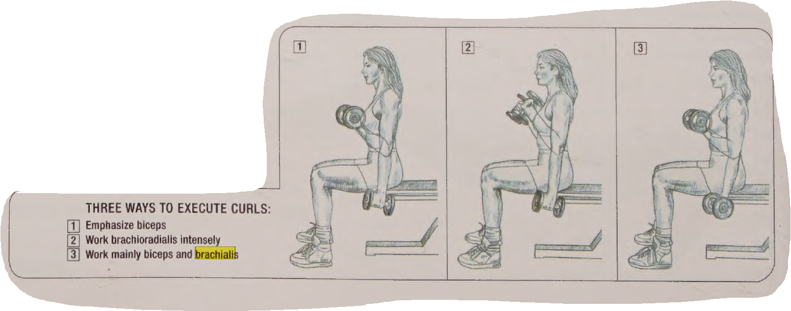

# Workout

## Monday Back & Biceps & Forearms

### Biceps Brachii
The primary function of the biceps brachii is to flex the elbow joint, bringing the forearm towards the upper arm. This action is involved in movements such as lifting, pulling, and bending the elbow.
The biceps brachii also plays a role in supinating the forearm, which involves rotating the palm to face upward.

### Brachialis
Is a muscle in the upper arm that flexes the elbow. It lies beneath the biceps brachii

### [Brachioradialis](https://www.kenhub.com/en/library/anatomy/brachioradialis-muscle)
 Is a muscle located in the lateral part of the posterior forearm, the main function is to flex the forearm, especially when the forearm is semi pronated in activities such as hammering.

:background_color(FFFFFF):format(jpeg)/images/library/13121/v4cjWb9YRtBJX2uCql7Sg_G2szyLxpqm_M._brachioradialis_1__1_.png){: style="height:400px;width:600px "}

-----

### Exercises

- [Body strenght](https://www.youtube.com/watch?v=Fj2RHhmqOho)
- 

- HAMMER CURLS 

- LOW-PULLEY CURLS

    

- 

-------

### Back

### Latissimus Dorsi (Lats)

 **Barbell row (pronated grip)**

 

**Chest supported rows with dumbbell**

### Trapezius (Traps)

**Dumbell Shrugs (sitted and standing)  you can roll your shoulders**

**Dumbbell incline row**

### Rhomboids

### Erector Spinae 

[lats](https://www.youtube.com/watch?v=WQasM7Jh9dQ)